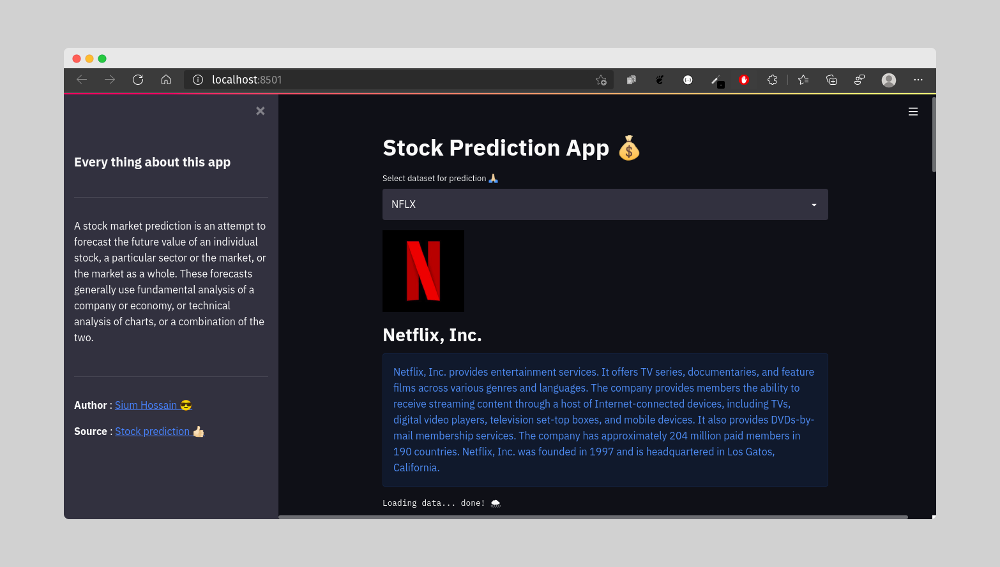

# Stock_prediction
**Stock forecasting by using fbprophet**

**Open this app [click_here](https://share.streamlit.io/siumhossain/stock_prediction/stock-prediction.py)**




# Usages
```bash
git clone https://github.com/siumhossain/stock_prediction.git
```
**Open terminal is this folder**

**Create virtualenv**

```bash
python3 -m venv your_virtual_env_folder_name

```
**Activate your virtual environment**

```bash
source your_virtual_env_folder_name/bin/activate
```
**Install requirement file for run this application**
```bash
pip3 install -r requirements.txt
```
**Run this applicatiion**
```bash 
streamlit run main.py
```
